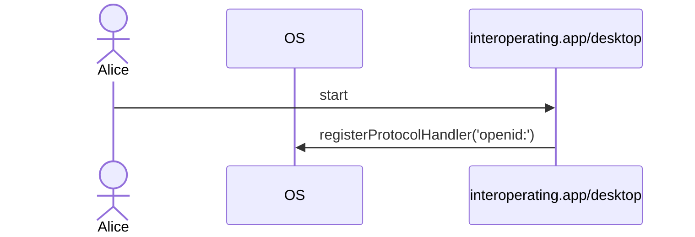
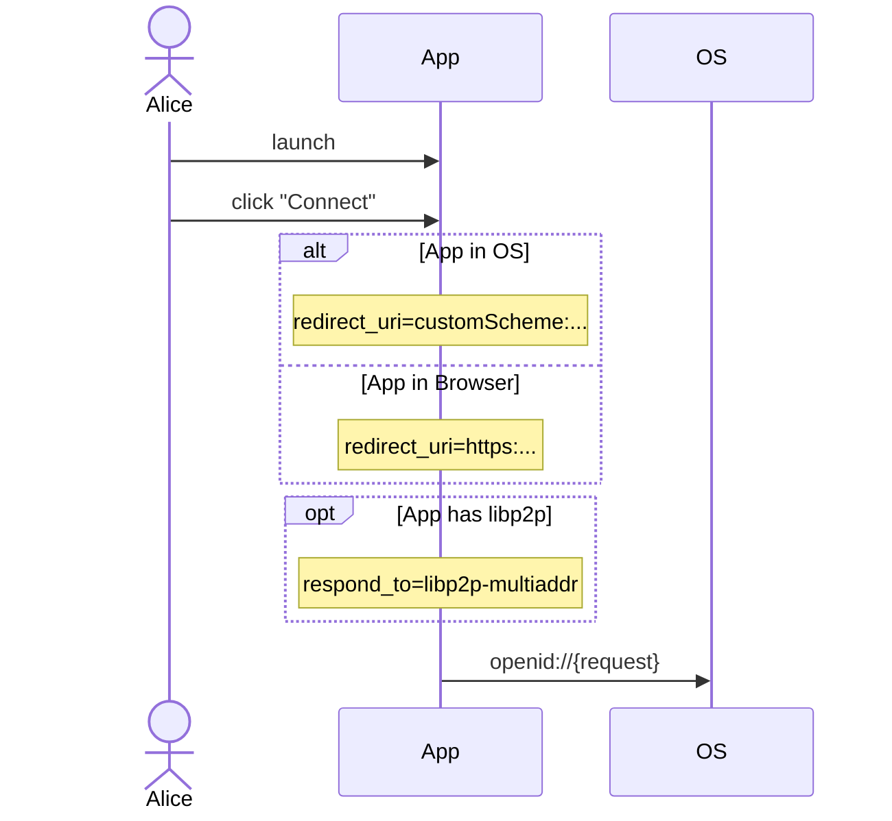
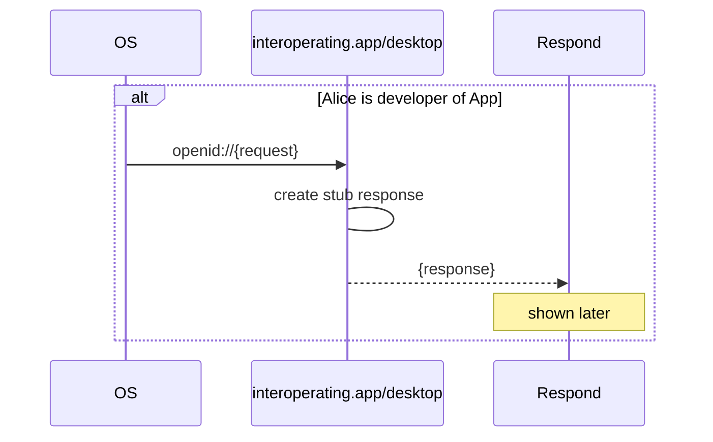
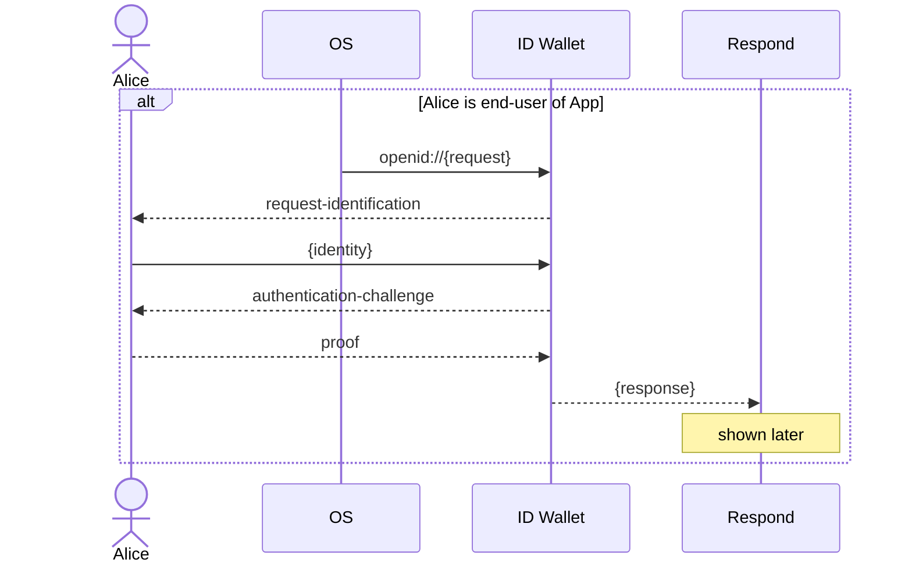
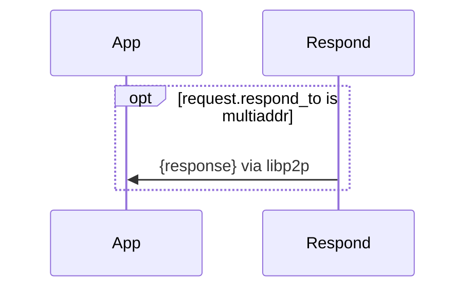
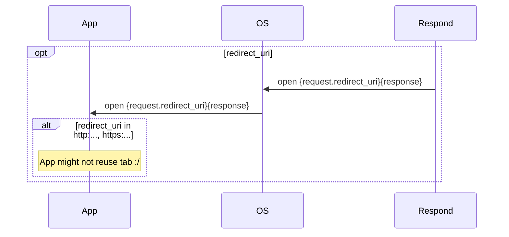
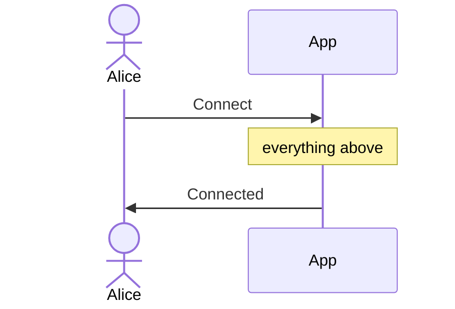
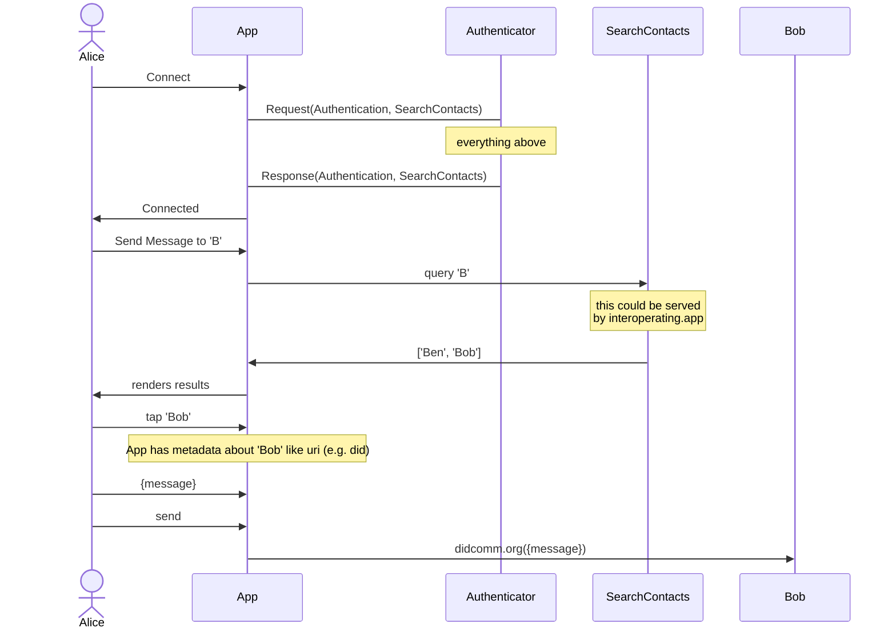

# interoperating.app

interoperating.app is an app that developers can use to develop apps against. It acts as a stub of useful protocols that the developed app may want to rely on.

After app development, the developer will release the app to their end-users. In practice, the end-users will decide which other apps they want their instance of the app to interoperate with.

For example, Bob may be a new user of Alice's app. Alice can develop the app's authentication functionality against interoperating.app. Later, Bob can use the finished app with an authentication provider of his choosing. This is because both Alice's interoperating.app devtool and Bob's rela-world authentication provider both implement the same authentication protocol.

Authentication is just one part of an app that interoperating.app can help you make interoperable and therefore configurable by your end-users.

## Connecting

### Starting interoperating.app

### Using an App to trigger Authentication

### Responding to AuthenticationRequest

Depending on whether the app is being used as part of app development or everyday use in production, the AuthenticationRequest is handled by a different app. Either way, an AuthenticationResponse is created, and the 'Respond' process will be explained in the next section.

#### In development, interoperating.app is the Identity Provider

#### In production, the end-user brings their own Identity Provider

### Responding to the App

If the AuthenticationRequst included a destination to send the response to, e.g. a libp2p multiaddr, it can dial that peer and send the response. This can be a good option in scenarios where there is no `redirect_uri` or the operating system is unable to deliver the response to the `redirect_uri`.

If the AuthenticationRequest has a `redirect_uri`, the Response can be delivered to it by asking the OS to open the `redirect_uri`.

Alice is connected.

---

## Using the App with your Friends

That was a lot of work just to connect. What was the point of connecting anyway?

Well the App is going to help you, Alice, talk to your friend Bob.

The App will need to help Alice search for which of her many 'Bob' friends to talk to today. But how can the App do this in such a way that Alice can bring her own social graph to the App?

The Authentication process can also result in a capability to search Alice's contacts.

